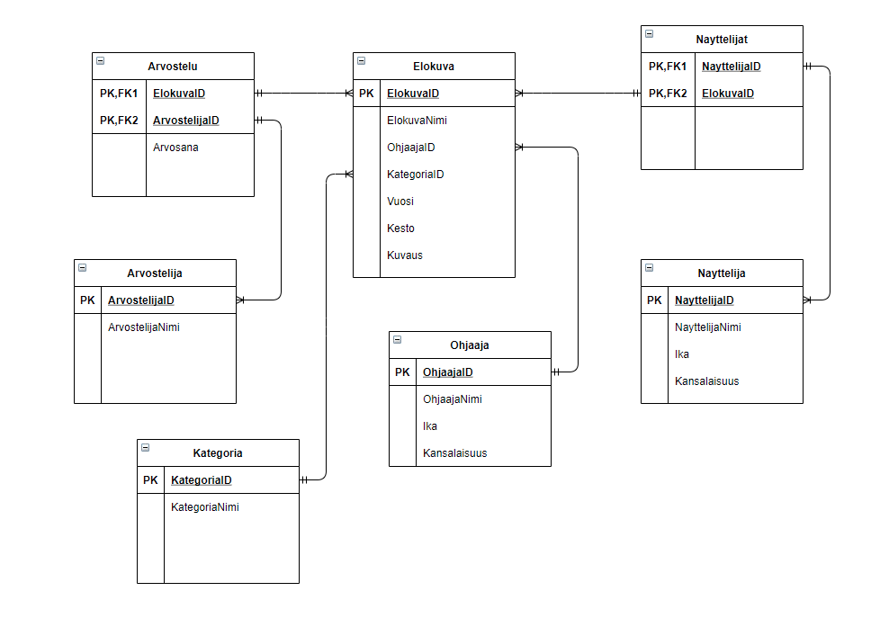

# Tietokannat - Harjoitustyö

VIDEO PLACEHOLDER

## Suunnitelma

### Vaatimusmäärittely

Aihe: Elokuvatietokanta

Tarkoituksena suunnitella ja luoda tietokanta, joka sisältää tietoa elokuvista, niiden arvosteluista ja muusta niihin liittyvästä.

??????????

### Käsiteanalyysi

| **Käsite-ehdokkaat:** | **Taulu** | **Taulu** | **Taulu** | **Taulu** | **Taulu** |
| --- | --- | --- | --- | --- | --- |
| ElokuvaID | ElokuvaID | Ohjaaja | Näyttelijät | Arvostelu | KategoriaID |
| ElokuvaNimi | ElokuvaNimi |  | Näyttelijä | Arvostelija | KategoriaNimi |
| Kuvaus | Kuvaus |
| Vuosi | Vuosi |
| Ohjaaja | Kesto |
| Näyttelijä |
| Arvostelija |
| Arvostelu |
| KategoriaID |
| KategoriaNimi |
| Kesto |
| Näyttelijät |

**Visuaalinen hahmotus ja lisää käsitteitä:**

Hahmotus tehty draw.io sovelluksella.

### ER-kaavio

---

## Tietokannan toteutus

### Tietokannan luonti

### Tietojen lisäys tauluihin

### SQL-skripti

### SQL-kyselyjä

---

## Käyttöliittymä

Kuvia, tekstiä ja linkki