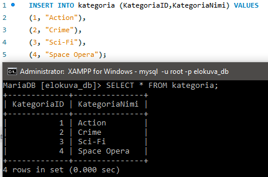
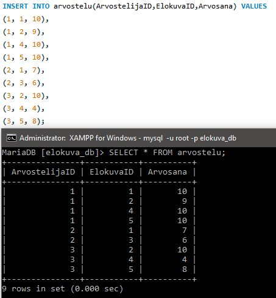

# Tietokannat TTC2020 - Harjoitustyö

VIDEON LINKKI

## Suunnitelma


### Vaatimusmäärittely

**Elokuvatietokanta**


* "elokuva_db" -tietokanta
* Työryhmä: Mikael Piirainen AA2799
* Versio 1.0


**1. Johdanto**

Tarkoituksena suunnitella ja luoda tietokanta, joka sisältää tietoa elokuvista, niiden arvosteluista ja näyttelijöistä ja muusta. Tietokanta luodaan harjoitustyönä TTC2020 kurssilla, jota opettaa Ari Rantala.

**2. Yleiskuvaus**

Tietokanta työstetään lokaalisti ja siirretään omalle palvelimelle, kun se on valmis. Tietokantaa varten luodaan  käyttöliittymä, jolla voidaan hakea tietoja verkkosivulle. Toteutus tehdään MySQL Workbench:illä sekä käyttöliittymä tehdään PHP-ohjelmointi kielellä. Dokumentaatio kirjoitetaan GitHubiin ja julkaistaan sivustona hyödyntäen MkDocs:ia.

**3. Toiminnot**

Pakolliset toiminnot:

* Elokuvien tietojen tallennus
* Arvostelujen teko
* Elokuvien haku tietokannasta

---

### Käsiteanalyysi


| **Käsite-ehdokkaat:** | **Taulu** | **Taulu** | **Taulu** | **Taulu** | **Taulu** |
| --- | --- | --- | --- | --- | --- |
| ElokuvaID | ElokuvaID | Ohjaaja | Näyttelijät | Arvostelu | KategoriaID |
| ElokuvaNimi | ElokuvaNimi |  | Näyttelijä | Arvostelija | KategoriaNimi |
| Kuvaus | Kuvaus |
| Vuosi | Vuosi |
| Ohjaaja | Kesto |
| Näyttelijä |
| Arvostelija |
| Arvostelu |
| KategoriaID |
| KategoriaNimi |
| Kesto |
| Näyttelijät |


**Visuaalinen hahmotus ja lisää käsitteitä:**

Hahmotus tehty draw.io sovelluksella.


**Perustelut ratkaisuille:**

* Elokuva ja Näyttelijä tauluilla on moni-moneen yhteys ja siihen syntyy liitostaulu Näyttelijät. Isäntätaulujen pääavaimet toimivat liitostaulun viiteavaimina. _Elokuvalla voi olla useita näyttelijöitä ja näyttelijät voivat olla useissa elokuvissa._

* Elokuva ja Arvostelija tauluilla samat perustelut kuin Elokuva - Näyttelijätauluilla, lisäksi liitostauluun lisätään arvosana.

* Elokuva ja Kategoria tauluilla on yksi-moneen yhteys. _Elokuva kuuluu kategoriaa ja kategoriaan voi kuulua useita elokuvia._ (Tiedostan, että useilla elokuvilla saatta olla monia kategorioita, mutta haluan tähän tietokantaan vain "pää kategorian").

* Elokuva ja Ohjaaja tauluilla on yksi-moneen yhteys. _Elokuvalla on yksi ohjaaja ja ohjaaja on voinut tehdä monta elokuvaa._ (Tämä on yleisin elokuvascenessä, vaikkakin poikkeuksiakin löytyy: "Russo Brothers: Avengers: Infinity War & Endgame, The Wachowskis: Matrix 1-3)

---

### ER-kaavio

ER-kaavio tehty MySQL Workbenchi:llä. Luovuin "kansalaisuudesta", koska sille pitäisi olla oma taulunsa, mutta se ei ole niin välttämätön elokuvatietokannassa.


---

## Tietokannan toteutus

### Tietokannan luonti

Tietokanta luodaan Workbenchin FORWARD ENGINEERING optiolla.

Tietokanta ja taulut onnistuivat.


### Tietojen lisäys tauluihin

Nyt kun tietokanta on luotu onnistuneesti, niin sinne voidaan lisätä dataa.

Tietojen lisäys _Kategoria_ tauluun:



Tietojen lisäys _Ohjaaja_ tauluun.


Tietojen lisäys _Nayttelija_ tauluun.


Tietojen lisäys _Elokuva_ tauluun.


Tietojen lisäys _Nayttelijat_ tauluun.


Tietojen lisäys _Arvostelija_ tauluun.


Tietojen lisäys _Arvostelu_ tauluun.



### SQL-skripti

Tietokannan luonti skripti.

```SQL
-- -----------------------------------------------------
-- Schema elokuva_db
-- -----------------------------------------------------
CREATE SCHEMA IF NOT EXISTS `elokuva_db` ; -- Luo kyseisen tietokannan, jos sitä ei ole
USE `elokuva_db` ; -- Ottaa luodun tietokannan käyttöön tulevia komentoja varten


-- -----------------------------------------------------
-- Table `Kategoria`
-- -----------------------------------------------------
CREATE TABLE IF NOT EXISTS `Kategoria` ( -- Luo taulun Kategoria, jos sitä ei ole
  `KategoriaID` INT NOT NULL, -- INT (numero) tyyppinen sarake
  `KategoriaNimi` VARCHAR(64) NOT NULL, -- Vaihtelevamerkki maksimissaan 64 merkkiä sarake
  PRIMARY KEY (`KategoriaID`)) -- Taulun pääavaimeksi valitaan KategoriaID
ENGINE = InnoDB;


-- -----------------------------------------------------
-- Table `Ohjaaja`
-- -----------------------------------------------------
CREATE TABLE IF NOT EXISTS `Ohjaaja` ( 
  `OhjaajaID` INT NOT NULL,
  `OhjaajaNimi` VARCHAR(64) NOT NULL,
  `Ika` INT(3) NOT NULL, -- INT on rajattu vain kolmilukuiseksi
  PRIMARY KEY (`OhjaajaID`))
ENGINE = InnoDB;


-- -----------------------------------------------------
-- Table `Elokuva`
-- -----------------------------------------------------
CREATE TABLE IF NOT EXISTS `Elokuva` (
  `ElokuvaID` INT NOT NULL,
  `OhjaajaID` INT NOT NULL,
  `KategoriaID` INT NOT NULL,
  `ElokuvaNimi` VARCHAR(128) NOT NULL, 
  `Vuosi` YEAR NOT NULL, -- sarake johon voi laittaa vain vuosiluvun
  `Kesto` INT(3) NOT NULL,
  `Kuvaus` VARCHAR(512) NOT NULL,
  PRIMARY KEY (`ElokuvaID`),
  INDEX `fk_Elokuva_Kategoria1_idx` (`KategoriaID` ASC), -- viitetaulujen määritys
  INDEX `fk_Elokuva_Ohjaaja1_idx` (`OhjaajaID` ASC),
  CONSTRAINT `fk_Elokuva_Kategoria1`
    FOREIGN KEY (`KategoriaID`)
    REFERENCES `Kategoria` (`KategoriaID`)
    ON DELETE NO ACTION
    ON UPDATE NO ACTION,
  CONSTRAINT `fk_Elokuva_Ohjaaja1`
    FOREIGN KEY (`OhjaajaID`) -- Ohjaajan id:tä ei toimintaa poiston tai päivityksen yhteydessä
    REFERENCES `Ohjaaja` (`OhjaajaID`)
    ON DELETE NO ACTION
    ON UPDATE NO ACTION)
ENGINE = InnoDB;


-- -----------------------------------------------------
-- Table Nayttelija`
-- -----------------------------------------------------
CREATE TABLE IF NOT EXISTS `Nayttelija` (
  `NayttelijaID` INT NOT NULL,
  `NayttelijaNimi` VARCHAR(64) NOT NULL,
  `Ika` INT(3) NOT NULL,
  PRIMARY KEY (`NayttelijaID`))
ENGINE = InnoDB;


-- -----------------------------------------------------
-- Table `Nayttelijat`
-- -----------------------------------------------------
CREATE TABLE IF NOT EXISTS `Nayttelijat` (
  `NayttelijaID` INT NOT NULL,
  `ElokuvaID` INT NOT NULL,
  PRIMARY KEY (`NayttelijaID`, `ElokuvaID`),
  INDEX `fk_Nayttelija_has_Elokuva_Elokuva1_idx` (`ElokuvaID` ASC),
  INDEX `fk_Nayttelija_has_Elokuva_Nayttelija_idx` (`NayttelijaID` ASC),
  CONSTRAINT `fk_Nayttelija_has_Elokuva_Nayttelija`
    FOREIGN KEY (`NayttelijaID`)
    REFERENCES `Nayttelija` (`NayttelijaID`)
    ON DELETE NO ACTION
    ON UPDATE NO ACTION,
  CONSTRAINT `fk_Nayttelija_has_Elokuva_Elokuva1`
    FOREIGN KEY (`ElokuvaID`)
    REFERENCES `Elokuva` (`ElokuvaID`)
    ON DELETE NO ACTION
    ON UPDATE NO ACTION)
ENGINE = InnoDB;


-- -----------------------------------------------------
-- Table `Arvostelija`
-- -----------------------------------------------------
CREATE TABLE IF NOT EXISTS `Arvostelija` (
  `ArvostelijaID` INT NOT NULL,
  `ArvostelijaNimi` VARCHAR(32) NOT NULL,
  PRIMARY KEY (`ArvostelijaID`))
ENGINE = InnoDB;


-- -----------------------------------------------------
-- Table `Arvostelu`
-- -----------------------------------------------------
CREATE TABLE IF NOT EXISTS `Arvostelu` (
  `ArvostelijaID` INT NOT NULL,
  `ElokuvaID` INT NOT NULL,
  `Arvosana` INT(10) NOT NULL,
  PRIMARY KEY (`ArvostelijaID`, `ElokuvaID`),
  INDEX `fk_Arvostelija_has_Elokuva_Elokuva1_idx` (`ElokuvaID` ASC),
  INDEX `fk_Arvostelija_has_Elokuva_Arvostelija1_idx` (`ArvostelijaID` ASC),
  CONSTRAINT `fk_Arvostelija_has_Elokuva_Arvostelija1`
    FOREIGN KEY (`ArvostelijaID`)
    REFERENCES `Arvostelija` (`ArvostelijaID`)
    ON DELETE NO ACTION
    ON UPDATE NO ACTION,
  CONSTRAINT `fk_Arvostelija_has_Elokuva_Elokuva1`
    FOREIGN KEY (`ElokuvaID`)
    REFERENCES `Elokuva` (`ElokuvaID`)
    ON DELETE NO ACTION
    ON UPDATE NO ACTION)
ENGINE = InnoDB;

-- Taulut tehty, tästä alkaa tietojen lisäys

INSERT INTO Kategoria (KategoriaID,KategoriaNimi) VALUES -- Lisää kategoria tauluun kyseiset arvot
(1, "Action"),
(2, "Crime"),
(3, "Sci-Fi"),
(4, "Space Opera");

INSERT INTO Ohjaaja (OhjaajaID,OhjaajaNimi,Ika) VALUES
(1, "Cristopher Nolan", 47),
(2, "Quentin Tarantino", 58),
(3, "The Wachowskis", 55),
(4, "George Lucas", 76);

INSERT INTO Nayttelija (NayttelijaID,NayttelijaNimi,Ika) VALUES
(1, "Christian Bale", 47),
(2, "John Travolta", 67),
(3, "Leonardo DiCaprio", 46),
(4, "Keanu Reeves", 56),
(5, "Mark Hamill", 69);

INSERT INTO Elokuva (ElokuvaID,OhjaajaID,KategoriaID,ElokuvaNimi,Vuosi,Kesto,Kuvaus) VALUES
(1, 1, 1, "The Dark Knight", 2008, 152, "Christopher Nolanin ohjaama Batman trilogian toinen osa, jossa Batman kohtaa arkkivihollisensa Jokerin."),
(2, 2, 2, "Pulp Fiction", 1994, 154, "Quentin Tarantinon klassikko-elokuva, joka on koostumus huumorista ja vakivallasta."),
(3, 1, 1, "Inception", 2010, 148, "Christopher Nolandin ohjaama ja kasikirjoittama mielta mullistava seikkailu."),
(4, 3, 3, "Matrix", 1999, 136, "Wachowskiesin ohjaama Sci-Fi elokuva kertoo sankari Neosta, joka huomaakin etta kaikki ei ole sita milta nayttaa."),
(5, 4, 4, "Star Wars", 1977, 121, "Gerge Lucasin masteriteos aloittaa Luke Skywalkerin tarinan kaukana galaksissa.");

INSERT INTO Nayttelijat (NayttelijaID,ElokuvaID) VALUES
(1, 1),
(2, 2),
(3, 3),
(4, 4),
(5, 5);

INSERT INTO Arvostelija (ArvostelijaID,ArvostelijaNimi) VALUES
(1, "Mikael"),
(2, "Pekka"),
(3, "Aleksi");

INSERT INTO Arvostelu(ArvostelijaID,ElokuvaID,Arvosana) VALUES
(1, 1, 10),
(1, 2, 9),
(1, 4, 10),
(1, 5, 10),
(2, 1, 7),
(2, 3, 6),
(3, 2, 10),
(3, 4, 4),
(3, 5, 8);

CREATE VIEW nakymainfo /* Luotu yksi näkymä joka tuo nimiä monista tauluista ja laskee arvosteluiden keskiarvon elokuvittain. 
Tiedot pinotaan yhteen ElokuvaID:llä ja järjestää Tähtien mukaan laskevassa järjestyksessä. */
AS SELECT KategoriaNimi AS Kategoria, ElokuvaNimi AS Elokuva, OhjaajaNimi AS Ohjaaja, NayttelijaNimi AS Nayttelija, AVG(Arvosana) AS Tahdet FROM Elokuva
INNER JOIN Nayttelijat
ON Elokuva.ElokuvaID = Nayttelijat.ElokuvaID
INNER JOIN Nayttelija
ON Nayttelijat.NayttelijaID = Nayttelija.NayttelijaID
INNER JOIN Ohjaaja
ON Elokuva.OhjaajaID = Ehjaaja.OhjaajaID
INNER JOIN Kategoria
ON Elokuva.KategoriaID = Kategoria.KategoriaID
INNER JOIN Arvostelu
ON Elokuva.ElokuvaID = Arvostelu.ElokuvaID
GROUP BY Elokuva.ElokuvaID ORDER BY Tahdet DESC;
```

### SQL-kyselyjä

SQL-kysely, joka hakee kaikki tietyn arvostelijan tekemät arvostelut.


Vapaavalintainen näkymä, johon tulee tärkeimmät tiedot tietokannasta.


---

## Käyttöliittymä

PHP on entuudestaan tuttu, vaikkenkaan ole siihen juuri koskenut 6-vuoteen, joten päätin tehdä jonkinlaisen käyttöliittymän. Päädyin tekemään "hakukoneen", joka hakee kaikista tauluista haettua merkkijonoa.

Kuvia demo liittymästä:

Haen hakusanalla "luke"


Koodi löytää Luke sanan Star Wars elokuvan kuvauksesta.


Valmista liittymää voi käyttää nettisivuillani, ja koodit ovat dokumentaation lopussa.

Käyttöliittymä: [http://migza.com/tietokannat/](http://migza.com/tietokannat/)

Käyttäjätunnus: migza
Salasana: noetarvaa

---

## Itsearviointi

???

## Koodit

Tässä käyttöliittymän koodit:

**index.php**

```HTML
<html>
<head>
<title>Tietokannat</title>
<link rel="stylesheet" href="tyylit.css">
	<script>
	function validateForm() {
	  var x = document.forms["myForm"]["form-name"].value;
	  if (x == "") {
		alert("Syötä kenttään tekstiä");
		return false;
	  }
	}
	</script>
</head>
<body>
	<header>
	<h1><a href="">Elokuvatietokanta</a></h1>
	</header>
	<nav>
		<div class="haku">
			<form  name="myForm" action="" onsubmit="return validateForm()" method="post">
			<input type="text" placeholder="Hae tietokannasta" name="form-name">
			<input type="submit" value="Hae">
			</form>
		</div>
	</nav>
		<?php
		include 'form.php';
		?>
	<footer>
		Mikael Piirainen - AA2799@student.jamk.fi
	</footer>
</body>
</html>
```

**form.php**

```PHP
<?php
if(isset($_POST['form-name']))
   {
	$servername = "localhost";
	$username = "root";
	$password = "";
	$dbname = "elokuva_db";
	$search = $_POST["form-name"];
	
	// Create connection
	$conn = new mysqli($servername, $username, $password, $dbname);
	// Check connection
	if ($conn->connect_error) {
	  die("Connection failed: " . $conn->connect_error);
	}

	echo "<div class='tulos'>";
	echo "<div class='tulos-sisä'>";
	echo "<h2>Elokuvat</h2>";
	echo "<hr>";
	
	$sql = "SELECT ElokuvaNimi, Vuosi, Kuvaus, Kesto, OhjaajaNimi, AVG(Arvosana) AS Tahdet, NayttelijaNimi, KategoriaNimi FROM Elokuva
	INNER JOIN Ohjaaja
	ON Elokuva.OhjaajaID = Ohjaaja.OhjaajaID
	INNER JOIN Arvostelu
	ON Elokuva.ElokuvaID = Arvostelu.ElokuvaID
	INNER JOIN Nayttelijat
	ON Elokuva.ElokuvaID = Nayttelijat.ElokuvaID
	INNER JOIN Nayttelija
	ON Nayttelijat.NayttelijaID = Nayttelija.NayttelijaID
	INNER JOIN Kategoria
	ON Elokuva.KategoriaID = Kategoria.KategoriaID
	WHERE 
	ElokuvaNimi LIKE '%" . $search .  "%' 
	OR Vuosi LIKE '%" . $search .  "%'
	OR Kuvaus LIKE '%" . $search .  "%'
	OR NayttelijaNimi LIKE '%" . $search .  "%'
	OR KategoriaNimi LIKE '%" . $search .  "%'
	OR OhjaajaNimi LIKE '%" . $search .  "%' GROUP BY Elokuva.ElokuvaID";
	$result = $conn->query($sql);

	if ($result->num_rows > 0) {
	  // output data of each row
	  while($row = $result->fetch_assoc()) {
		echo "<h3>" . $row["ElokuvaNimi"] . "</h3>" .
			"Ohjaaja: " . $row["OhjaajaNimi"] . "<br>" .
			"Näyttelijä: " . $row["NayttelijaNimi"] . "<br><br>" .
			"Kategoria: " . $row["KategoriaNimi"] . "<br>" .
			"Vuosi: " . $row["Vuosi"] . "<br>" .			
			"Kesto: " . $row["Kesto"] . " min<br>" .
			"Tähdet: " . $row["Tahdet"] . "<br><br>" .
			"Kuvaus: " . $row["Kuvaus"] . "<br><hr>";
	  }
	} else {
	  echo "Ei tuloksia.";
	}
	echo "</div></div>";
	
	$conn->close();
   }
?>
```

**tyylit.css**

```CSS
@import url('https://fonts.googleapis.com/css2?family=Abel&display=swap');

body {
	margin: 0;
	padding: 0;
}

.haku {
	font-family: Arial;
	padding: 0;
	margin: 0;
	display: inline: block;
}

.tulos {
	margin: 10px 30%;
	display: block;
	box-shadow: 0 0.25em 0.5em 0 rgba(0, 0, 0, 0.2);
	padding: 20px;
	overflow: hidden;
}

.tulos-sisä {
	text-align: left;
	font-family: arial;
	overflow: hidden;
}

form {
	padding: 0;
	margin: 10;
}

header {
	margin: 0;
	padding: 20px 0;
	text-align: center;
	background-color: #575757;
}

h1 {
	margin: 0;
	padding: 0;
	font-family: 'Abel', sans-serif;
	color: #f5f0f0;
	letter-spacing: 0.1em;
}

a:link, a:visited {
    color: #f5f0f0;
    background-color: transparent;
	text-decoration: none;
}

nav {
	background-color: grey;
	padding: 0;
	margin: 0;
	text-align: center;
	overflow: hidden;
	display: block;
}

footer {
	background-color: #575757;
	font-family: arial;
	text-align: center;
	margin-top: 20px;
	padding: 10px;
	color: #f5f0f0;
}

input[type=text] {
  width: 30%;
  padding: 12px 20px;
  margin: 8px 0;
  box-sizing: border-box;
}

input[type=submit] {
  padding: 12px 20px;
  text-decoration: none;
  margin: 8px 0;
  cursor: pointer;
  box-sizing: border-box;
}
```